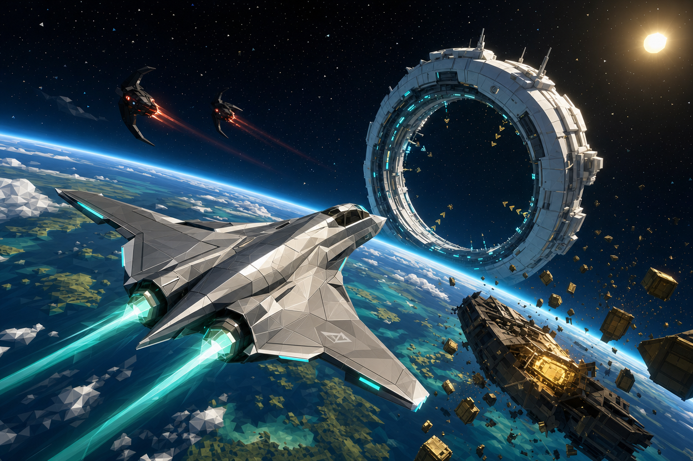
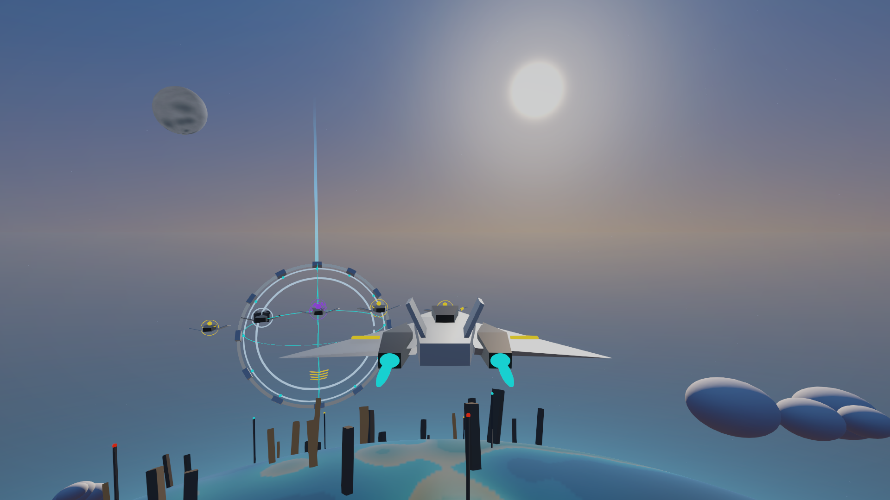
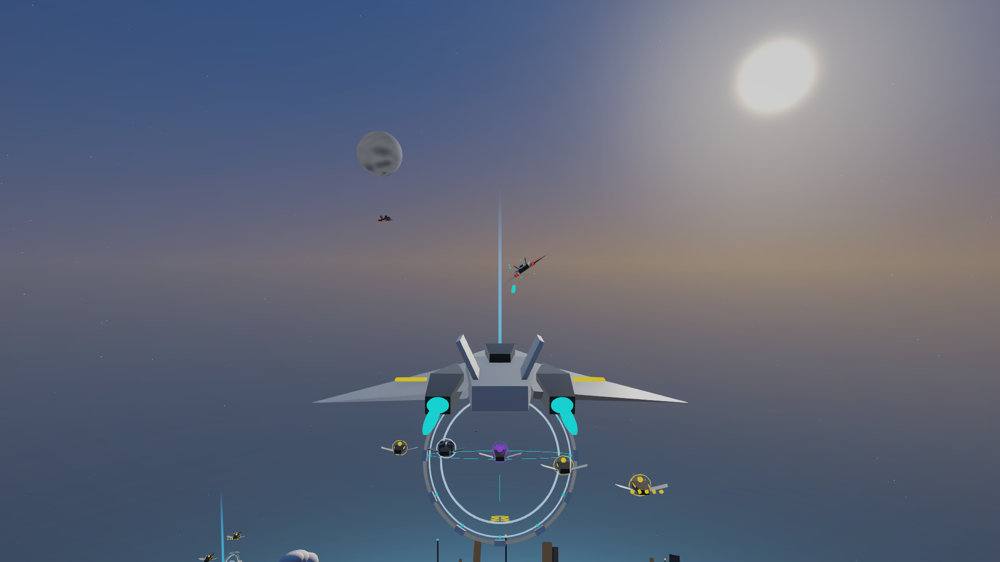
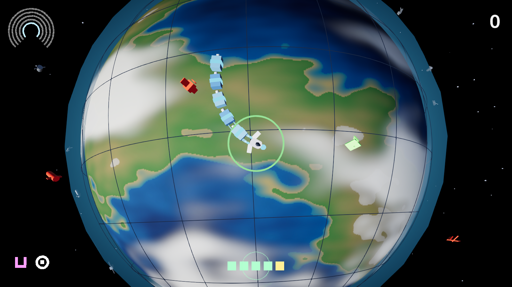
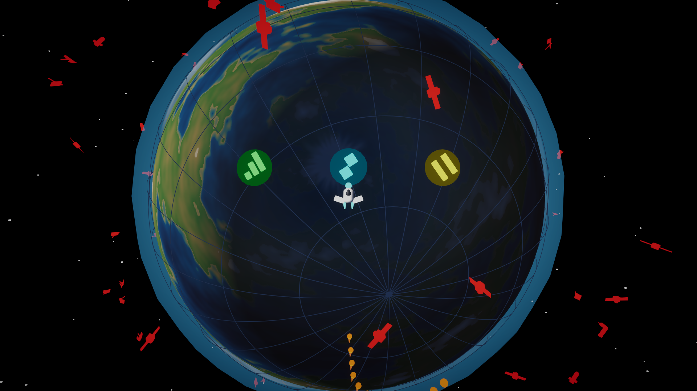

# RIFT — planetary salvage arena

A small-planet aerial combat / salvage prototype built in **Unity 6000.6.1f1** (URP, new Input System). Shoot the reactors on derelict ships, scoop up the gold salvage they spill, and fly through a refinery ring to bank it before one of seven AI rivals shoots it back out of you.

Everything in the arena — the planet, sky, sun, moon, clouds, ships, wrecks, refinery rings, ground scatter, sounds — is generated from code at runtime. There are no imported models, textures, audio, prefabs, colliders or rigidbodies: ~2500 lines of C# in `My project/Assets/Scripts` plus four custom URP shaders.




## Play

1. Open `My project` in Unity Hub (6000.6.1f1) and let Package Manager resolve dependencies.
2. Open `Assets/Scenes/SampleScene.unity` and press Play. The arena builds itself; no menu.

Or skip the Editor: `"$UNITY" -batchmode -nographics -quit -projectPath "My project" -executeMethod RiftBuild.MacOS` writes `Builds/RIFT.app`, and `open Builds/RIFT.app` flies.

| Input | Action |
| --- | --- |
| Mouse | Pitch / bank (small tethered circle shows stick deflection) |
| W / S · A / D · Q / E | Pitch · roll · rudder |
| Left Shift / Left Ctrl | Throttle up / down |
| Space | Boost (recharging fuel) |
| Left mouse / F | Cannon with lead assist (spread opens with heat) |
| Right mouse | Start a 1.2 s seeker lock on the boxed target; press again once locked to fire |
| C | Recenter mouse |
| Escape | Pause — comfort settings (shake scale, reduced flashing, reduced camera motion) live here |
| Enter | Restart the match from the results screen |
| ← / → on the results screen | Rival difficulty: ROOKIE / PILOT / ACE, remembered for the next match |

Full rules, flight-model notes and the verification checklist are in [`PLAYTEST.md`](./PLAYTEST.md).

## The loop

- **Salvage** — shoot the glowing gold reactor on a wreck; it bursts into salvage cubes that fly to the nearest pilot.
- **Bank** — hold inside a refinery ring for ~1.4 s to claim it and convert carried cargo into score. Two pilots in the same ring contest it and nothing banks.
- **Fight** — death spills carried cargo but keeps banked score; you redeploy in three seconds. Seven named rivals with distinct personalities gather, fight, retaliate, repair and bank on the same rules — and the same flight model — you do.
- **Match** — five minutes on the clock, a results screen, Enter to go again. Every 90 s one refinery overcharges and pays double for 30 s; three unanswered kills crown an ace with a bounty the whole field hunts.
- **Trade-offs** — cargo has weight, so a full hold turns and climbs worse. Surface fields are cheap and thick-aired; low-orbit fields pay triple in air too thin to fight in. Volatile wrecks detonate, armoured wrecks shrug off cannon fire and beg for a missile. Come down too fast and the hull burns.

## Verify (headless, no clicking)

Both deterministic suites and a five-frame screenshot pass run from the command line with the Editor closed:

```bash
UNITY="/Applications/Unity/Hub/Editor/6000.6.1f1/Unity.app/Contents/MacOS/Unity"
PROJECT="$(pwd)/My project"
"$UNITY" -batchmode -nographics -projectPath "$PROJECT" -executeMethod RiftHeadlessRunner.Run -logFile /tmp/rift-verify.log   # exit 0 = pass
"$UNITY" -batchmode -projectPath "$PROJECT" -executeMethod RiftScreenshotRunner.Run -logFile /tmp/rift-shots.log              # writes docs/screenshots/*.png
```

The same suites are also Editor menu items that run in Play Mode:

- `Rift > Verify planetary arena` — population, collection, banking, contest, cargo drops, respawns, pause, swept hits, neutral flight, match phases, cargo weight, overcharge, re-entry heat, landmarks, HUD feed, comfort settings, audio mix, site value bands.
- `Rift > Verify flip stability and rival combat` — chase camera through loops at 30/60/144 fps, AI perception and retaliation, real projectile hits, precision band, seeker lock and boost counter, auto-level, heat spread, safe respawn, crash vs shot-down, wreck variants, ace bounty.

Both throw on failure and log a `PASS` line on success.

## ORBIT SNAKE (second game)




**Play it in the browser: <https://stevenli-phoenix-work.itch.io/orbit-snake>** (WebGL, plus a macOS download).

A snake on the shell of a junk-choked planet, in the same project and the same zero-asset style: the planet, clouds, atmosphere, stars, ships, junk, particles, music and every sound effect are generated at start-up. Top-down, constant speed, one control (turn), one button (Space), and a HUD with no words in it. Junk rides great circles; come up behind it with a matching heading and it becomes a segment, hit it any other way and you shed two. Bite your own tail and the loose segments become wreckage on the shell. At the quota, Space throws the whole train into the atmosphere and lifts you into the next, denser shell, where three skill icons float ahead of you: fly through one to keep it for the run. Linger and the Kessler clock fills the shell; die and your wreck waits there next time. Keyboard or gamepad.

```bash
"$UNITY" -batchmode -nographics -projectPath "$PROJECT" -executeMethod OrbitHeadlessRunner.Run -logFile /tmp/orbit-verify.log   # 24 rule checks
"$UNITY" -batchmode -nographics -quit -projectPath "$PROJECT" -executeMethod RiftBuild.OrbitMacOS -logFile /tmp/orbit-build.log  # Builds/ORBIT.app
scripts/build-webgl.sh   # 24 checks -> RiftBuild.OrbitWebGL (edit-mode checks, Gzip + fallback, Itch template) -> scripts/check-webgl.mjs -> Builds/ORBIT-web/
```

### Publishing to itch.io

The release path is the one proven on [unity-flappybird](https://github.com/StevenLi-phoenix/unity_flappy_bird): `scripts/build-webgl.sh` builds and validates the bundle locally (`node --test scripts/*.test.mjs` covers the validator), and `.github/workflows/publish.yml` does the same on GitHub-hosted runners for every push to `main` (GameCI `unityci/editor:ubuntu-6000.6.1f1-webgl-3`, then official butler 15.31.0 pushes `Builds/ORBIT-web` to `stevenli-phoenix-work/orbit-snake:html` with the commit SHA as the version). The workflow needs four repository secrets, set by a repo admin and never pasted into chat or files in git: `UNITY_LICENSE`, `UNITY_EMAIL`, `UNITY_PASSWORD` (GameCI Personal-licence activation) and `BUTLER_API_KEY` (an itch.io API key with the `wharf` scope). Until they exist the workflow fails at its credential preflight with the missing name, and the manual path is:

```bash
butler push Builds/ORBIT-web stevenli-phoenix-work/orbit-snake:html --userversion <version>
butler push Builds/ORBIT.app  stevenli-phoenix-work/orbit-snake:mac  --userversion <version>
```

Play it at <https://stevenli-phoenix-work.itch.io/orbit-snake>. Draft creation and a local build are not publication: check the public page runs and that `butler status` shows the version you meant.

## Tooling

- [`AGENTS.md`](./AGENTS.md) — architecture notes and constraints for AI coding agents.
- [`MCP-SETUP.md`](./MCP-SETUP.md) — MCP for Unity bridge (`Window → MCP for Unity`, HTTP on `localhost:8080`).
